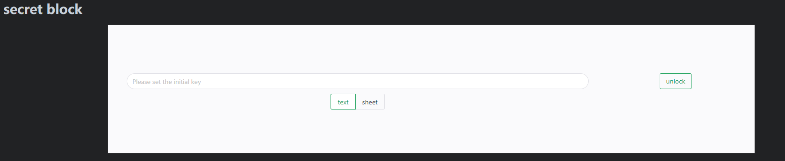

# sy-secret-block

just a translation to english

## Function
An encrypted text block that can be used to store passwords.
Enter a password to encrypt and unlock text blocks. After the block is created, the password entered for the first time is the password used for encryption.
After entering the password, all blocks with the same password in the open page will be unlocked.
14-digit passwords can also be automatically generated.

## Manual installation
Download the compressed package in the release, unzip it, and put it in the `working directory/data/widgets/sy-secret-block`.

## other
I once wanted to develop a password management software, but I was too lazy to download various third-party applications, and I didn't trust the security of the third-party, so I planned to develop one myself. However, cloud synchronization and multi-terminal APP are very troublesome to do, so I have never done it.

Members who bought Siyuan Notes recently found that the pendant is really a magical function. You can use the front-end technology to make a small pendant, you can use the synchronization of the notebook body, and you can organize it with other rich texts... It's really great!

So I made this little pendant. After the pendant is created, the password entered for the first time will be used to encrypt the pendant, and if it is entered later, it will be decrypted with this password. For convenience, a ten-minute unlock time is maintained after entering the password.

Due to the design purpose of storing passwords, there is also a shortcut key for generating a random 14-digit password.

Don't worry, no key information is stored, i.e. if you forget the passphrase, it can never be decrypted again (without brute force). The content itself is encrypted and stored, so don't think about bypassing the password by viewing the properties~

**Note**, this pendant is still inconvenient and may not meet your needs:

After the block is created, the default block size is not the most comfortable and needs to be adjusted manually.
Only plain text can be saved in the text block, not notes.
There doesn't seem to be a way to save the plugin's global information, so it's impossible to configure default settings, such as password generation length and method.

## Version
v0.2.5
- Added the function of choosing whether to unlock in batches.

v0.2.3
- Fixed the issue that the missing README would not be recognized by the widget repository.

v0.2.1
- Optimize the position of the menu button to prevent the scroll bar from being obstructed.
- Optimized the problem of unexpected scroll bars when adjusting widgets.

v0.2.0
- Add the function of changing password
- Optimize the situation where multiple blocks use different passwords, there should be no strange problems (but please don't mix passwords~)

v0.1.x
- basic skills
